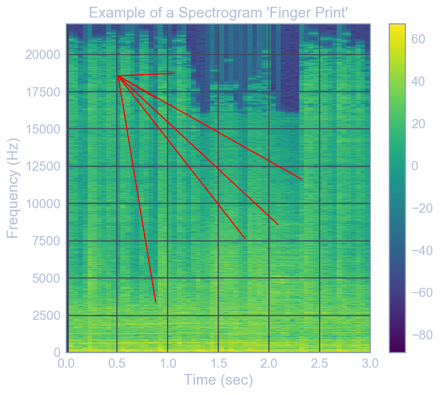

# songfp
`songfp` is a Python package that performs song-fingerprint matching. **This is a re-implementation/simplification of the [dejavu](https://github.com/worldveil/dejavu) project.** Authorship should effectively be attributed to [Will Drevo](http://willdrevo.com/fingerprinting-and-audio-recognition-with-python/#) (GitHub user [worldveil](https://github.com/worldveil)), who created dejavu.

In effect, `songfp` provides a service similar to popular song-recognition programs like Shazaam. It can "listen" to a song, and match it against a database of song fingerprints, which is populated by the user. 

`songfp` was created as a prototype for the CogWorks 2017 summer program, in the [Beaver Works Summer Institute at MIT](https://beaverworks.ll.mit.edu/CMS/bw/bwsi). It was developed by [Ryan Soklaski](https://github.com/LLrsokl), the lead instructor of CogWorks 2017. 




## Installation Requirements
It is assumed that you have the base anaconda distribution installed (with, e.g., numpy, matplotlib, scipy, and jupyter)
Begin by installing the [microphone](https://github.com/CogWorksBWSI/Microphone) library. Next, you will need to install
`ffmpeg` and `librosa` as follows:

### Installing Required Packages (verified for Windows & Mac OSX)
```shell
conda install -c conda-forge ffmpeg librosa 
```


### Installing songfp (this project)
Having installed the required packages, clone this repository and navigate to the AudioProject directory, and run: 
```shell
python setup.py develop
```

You are then good to go! See the `Tutorial.ipynb` notebook for a brief tutorial. This includes configuring/testing a microphone, adding songs to the fingerprint database, saving the database, matching samples form a microphone recording against the database, and visualizing the spectrogram/fingerprints for a song or recording.


## Basic Documentation
The following are the user-facing functions/objects provided by `songf` - each one can be imported via `from songfp import <object_name>`:

 - `song_list: List[str]` 
    - The list of songs that have been added to the song fingerprint-database.
 - `add_songs_to_database: Callable[[Union[str, Sequence[str]], None]]` 
    - Add one or more songs to the fingerprint database by specifying the paths to their audiofiles (.mp3, .wav, and maybe other formats)
 - `save_song_database : Callable[[None], None]` 
    - Save the state of the fingerprint database to disk. The database will be reloaded in this state upon importing `songfp`.
 - `clear_database : Callable[[bool], None]`
    - Remove all of the songs from the database. (Pass `True` to confirm that you want to do this).
 - `match_sample : Callable[[numpy.ndarray], str]`
    - Provide the pcm signal for an audio sample, and return the best-matched song name from the database.
 - `match_recording : Callable[[float], str]`
    - Record an audio sample for the specified time (in seconds), and return the best-matched song name from the database.
 - `plot_song : Callable[[Union[str, numpy.ndarray]], matplotlib_objects]`
    - Given filepath to a song-file, or the pcm signal itself, plot the spectrogram and fingerprints for the song.
 - `plot_recording : Callable[[float], matplotlib_objects]`
    - Record a song for the specified amount of time, and plot its spectrogram/fingerprints.


